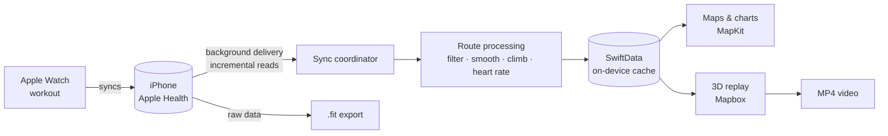

<p align="center"><b>English</b> · <a href="README_ZH.md">繁體中文</a></p>

<h1 align="center">Revisit</h1>

<p align="center">
  <b>Relive your Apple Watch workouts as 3D flyovers.</b><br>
  Native iOS. No account, no server — your data stays on your iPhone.
</p>

<p align="center">
  
  
  
  
  
</p>

<p align="center">
  
</p>

Revisit is a native iOS app that reads the workouts your Apple Watch records in Apple Health and rebuilds them on satellite imagery and 3D terrain. Replay a run or ride as a flyover — in the spirit of Strava and Relive — export the replay as a video, or export the whole workout as a `.fit` file for other platforms.

When your Watch finishes a workout and syncs to your iPhone, Revisit picks it up in the background, prepares the route, and sends you a notification.

> The screenshots and videos below are the author's real workouts; only the device name has been replaced with "Apple Watch". The app's interface is currently in Traditional Chinese.

## Features

- **Automatic sync** — reads workouts from Apple Health and syncs in the background as soon as your Watch finishes recording, with a notification.
- **Colored routes** — routes drawn on satellite imagery with a smooth gradient by pace, heart rate, or elevation.
- **Interactive charts** — pace, heart rate, and elevation charts; drag across them and the matching spot is highlighted on the map.
- **3D flyover replay** — satellite imagery on real terrain. The camera starts with an overview, then follows you along the whole route and swings smoothly through turnarounds. Pause, scrub, and pick a 15, 30, or 60-second replay.
- **Video export** — renders the replay to a 1080×1920, 30 fps MP4 (9:16, ready for Instagram Stories) with distance, time, pace, and heart rate overlaid. Every frame waits until the map has fully loaded, so there are no half-drawn tiles.
- **`.fit` export** — builds a Garmin FIT file straight from the raw Health data, importable into Strava, Garmin Connect, and others. Pool swims include every length's stroke type, stroke count, and rests.
- **Supported workouts** — outdoor running, walking, hiking, cycling, and open-water swimming with maps; treadmill runs, indoor walks, indoor rides, and pool swims without a map, but viewable and exportable.

## Demo

<table>
  <tr>
    <th>3D replay (in the app)</th>
    <th>Exported video</th>
  </tr>
  <tr>
    <td align="center"></td>
    <td align="center"></td>
  </tr>
</table>

| Workouts | Colored by speed | Scrubbing the charts | Colored by pace |
|:---:|:---:|:---:|:---:|
|  |  |  |  |

| 3D replay | Pool swim | `.fit` export |
|:---:|:---:|:---:|
|  |  |  |

## How it works



- **Reading** — `HKAnchoredObjectQuery` fetches added and deleted workouts incrementally; an `HKObserverQuery` with background delivery wakes the app after the Watch syncs. Health data can't be read while the phone is locked, so Revisit catches up after you unlock.
- **Route processing** (pure Swift, unit tested) — drops inaccurate and jumping GPS fixes, splits at pauses, smooths elevation and measures climb with a threshold, and interpolates heart rate onto every point.
- **Replay** — the timeline runs on moving time (pauses removed). Camera headings are precomputed with a turn-rate limit, so scrubbing always gives the same shot. Map tiles around the route are downloaded before playback.
- **FIT encoder** — a from-scratch implementation of the FIT binary format (header, definitions, CRC), verified with the independent parser [fitdecode](https://github.com/polyvertex/fitdecode).

## Tech stack

| | |
|---|---|
| Language & UI | Swift 6 (strict concurrency), SwiftUI, `@Observable` |
| Data | HealthKit, SwiftData (on-device only, never synced to iCloud) |
| Maps | MapKit (list and details), [Mapbox Maps SDK](https://github.com/mapbox/mapbox-maps-ios) 11 (3D replay and video) |
| Charts & video | Swift Charts, AVFoundation |
| Tests | Swift Testing |
| Dependencies | Mapbox only, via Swift Package Manager |

## Getting started

### Requirements

- An Apple silicon Mac with **Xcode 27** or later, with the license accepted: `sudo xcodebuild -license accept`
- An iPhone, and an Apple Watch to record workouts
- An Apple ID signed in to Xcode (Xcode → Settings → Accounts). A free account can install on your own phone but must reinstall every 7 days; TestFlight and the App Store need a paid Apple Developer Program membership.
- Optional: a [Mapbox](https://account.mapbox.com) public token for the 3D replay and video export. Without one, the replay falls back to Apple Maps and video export is unavailable.

### First-time setup

1. Create your local settings file (git-ignored):

   ```sh
   cp Config/Secrets.example.xcconfig Config/Secrets.xcconfig
   ```

   Then fill in:
   - `MAPBOX_ACCESS_TOKEN` — your Mapbox public token (starts with `pk.`).
   - `REVISIT_DEVELOPMENT_TEAM` — your Apple Developer Team ID.
   - `REVISIT_BUNDLE_ID_PREFIX` — a prefix you own, e.g. `com.yourname`. Bundle IDs are unique across all of Apple, so you can't reuse someone else's.

2. Connect your iPhone with a cable and tap **Trust** on the phone.
3. Turn on Developer Mode: Settings → Privacy & Security → Developer Mode. The option only appears after the phone has been connected to Xcode; the phone restarts when you turn it on.
4. Sign once in Xcode: open `Revisit.xcodeproj`, choose your iPhone at the top, and press ⌘R.

### Installing on your iPhone

```sh
scripts/install.sh                 # the connected iPhone
scripts/install.sh "Jane's iPhone" # pick one by name or UDID when several are connected
```

The script finds the phone, checks that it trusts the Mac and has Developer Mode on, builds and signs, installs, and launches the app. If something goes wrong it explains why; the full log is in `build/DerivedData/install.log`. You can also pass signing settings as environment variables instead of using the settings file:

```sh
REVISIT_DEVELOPMENT_TEAM=ABCDE12345 REVISIT_BUNDLE_ID_PREFIX=com.jane scripts/install.sh
```

If the phone says "Untrusted Developer" on first launch: Settings → General → VPN & Device Management → trust your developer account.

## Development

Unit tests (route processing, camera, color scale, FIT encoding, and more):

```sh
xcodebuild -project Revisit.xcodeproj -scheme Revisit \
  -destination 'platform=iOS Simulator,name=iPhone 16 Pro' test
```

The simulator has no Apple Watch, so Debug builds accept a few launch arguments (Xcode → Scheme → Run → Arguments):

| Argument | Effect |
|---|---|
| `-demoData -onboardingCompleted YES` | Skip Apple Health and load sample routes in Taiwan (Daan Forest Park, Elephant Mountain, Keelung River, Sun Moon Lake, a treadmill run, a pool swim) |
| `-skipHealthKit` | Use the on-disk database without touching Apple Health, e.g. one copied from a phone |
| `-openWorkout N` | Open the (N+1)th newest workout (`-openFirstWorkout` opens the newest) |
| `-openReplay`, `-replayProgress 0.4` | Open the 3D replay and freeze it at 40% |
| `-openExport` | Open the replay and immediately export a 15-second video |
| `-exportFIT` | Export the opened workout as `.fit` right away |
| `-anonymize` | Show the recording device as plain "Apple Watch", for public screenshots |

To exercise the real Apple Health flow in the simulator: Settings tab → 開發測試 (Developer) → 寫入範例運動到「健康」 (write sample workouts to Health).

### Project structure

```
Revisit/
├── App/          Entry point, composition root, notifications
├── Health/       HealthKit reads, sync, sample data
├── Models/       SwiftData model and route data types
├── Processing/   Route cleanup, sampling, color scales (pure Swift)
├── Map/          MapKit maps and route drawing
├── Replay/       3D replay: timeline, camera, Mapbox/MapKit renderers, video export
├── Export/       FIT encoding and export
└── Features/     Screens (list, details, settings, onboarding)
RevisitTests/     Unit tests
scripts/          install.sh
Config/           Signing, Info.plist, entitlements, settings template
```

## Privacy

- Workout data is read from Apple Health and stored on your iPhone only. Revisit has no server, uploads nothing, and never syncs to iCloud.
- The 3D replay and video export download map tiles around the route from Mapbox, which also receives anonymous usage events for billing. See [Mapbox's privacy policy](https://www.mapbox.com/legal/privacy).
- `.fit` files and videos are created only when you tap export, and you decide where they go through the system share sheet.

## Known limitations

- The first replay of a long route has to download the map first, which can take over a minute on a slow connection; replays of the same route start almost immediately afterwards.
- Health data can't be read while the phone is locked, so new-workout notifications wait until you unlock it.
- Mapbox place names follow the system language and can't yet be set separately.

## Roadmap

- [ ] History: calendar, weekly and monthly distance, a heatmap of all routes
- [ ] TestFlight and App Store release
- [ ] GPX export
- [ ] More sensor data: cycling cadence and power, running power
- [ ] English interface

## License and credits

- Released under the [MIT License](LICENSE).
- The 3D replay uses the [Mapbox Maps SDK for iOS](https://github.com/mapbox/mapbox-maps-ios) under the [Mapbox Terms of Service](https://www.mapbox.com/legal/tos); map data © Mapbox © OpenStreetMap © Maxar.
- `.fit` files follow Garmin's published [FIT protocol](https://developer.garmin.com/fit/protocol/).
- Revisit is not affiliated with Apple, Garmin, Strava, or Mapbox.
