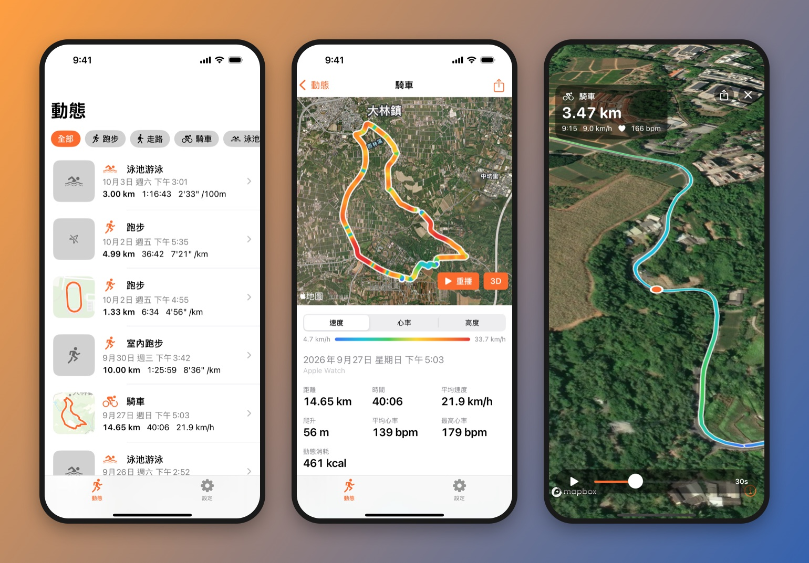
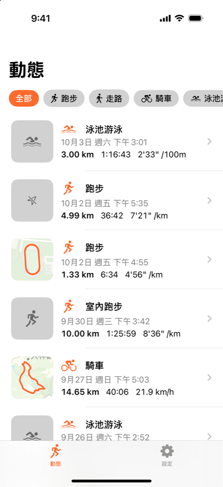
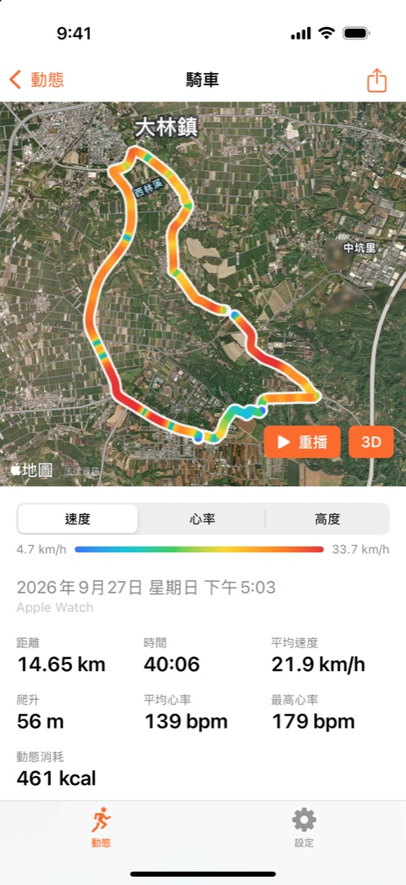
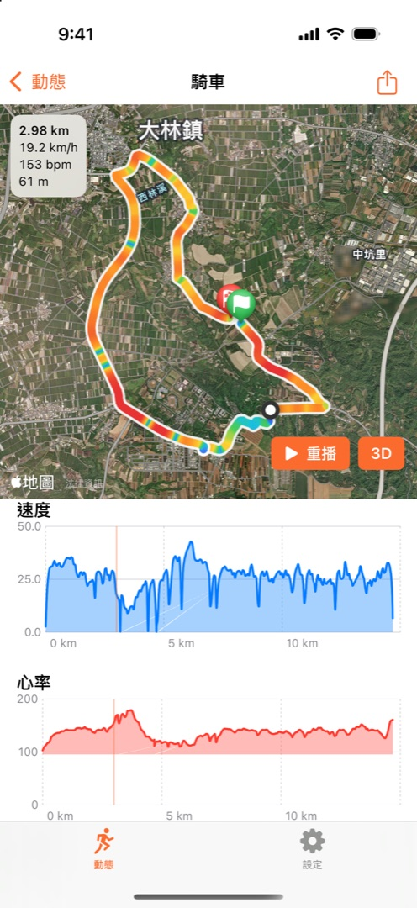
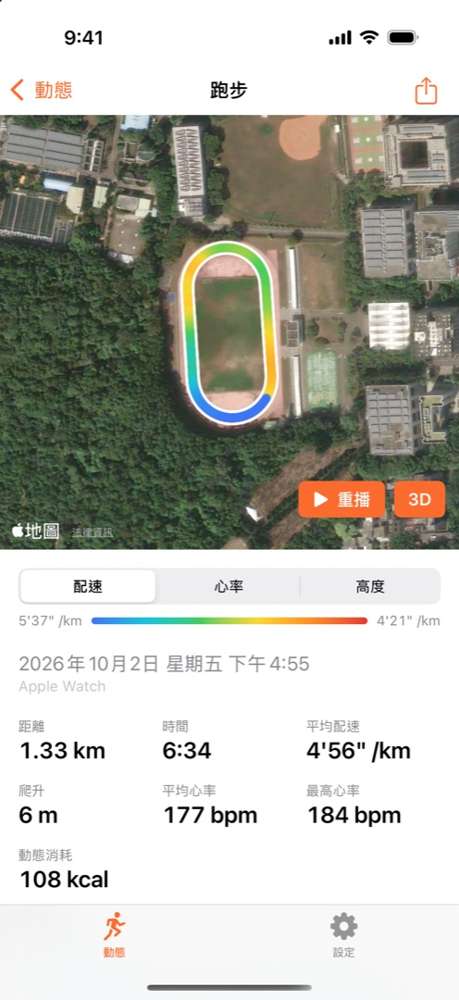
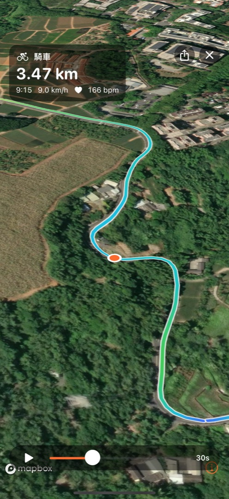
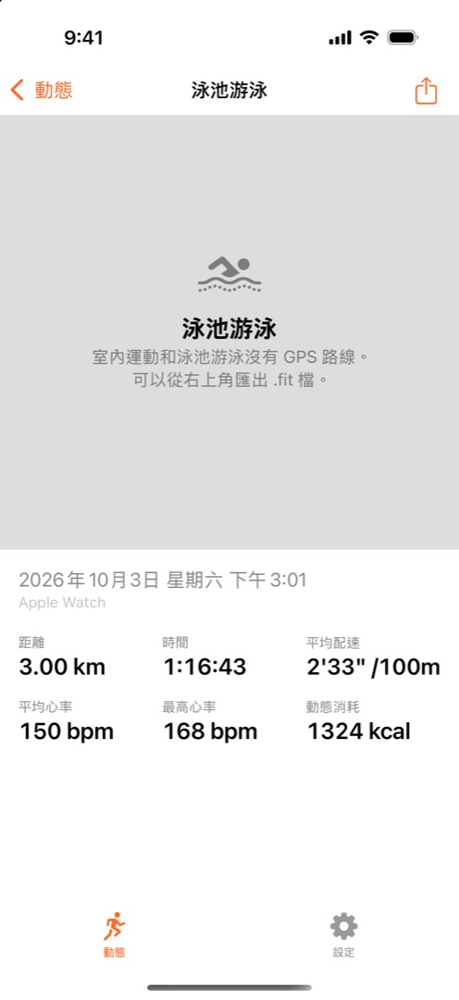
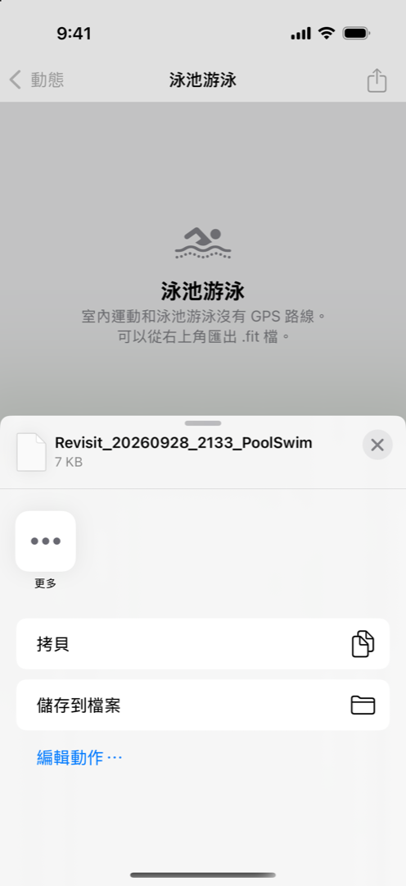

<p align="center"><a href="README.md">English</a> · <b>繁體中文</b></p>

<h1 align="center">Revisit</h1>

<p align="center">
  <b>把 Apple Watch 記錄的每一次運動，在 3D 地圖上重新走一遍。</b><br>
  Relive your Apple Watch workouts as 3D flyovers — native iOS, no server, your data stays on your phone.
</p>

<p align="center">
  
  
  
  
  
</p>

<p align="center">
  
</p>

Revisit 是一個原生 iOS App。它直接讀取 iPhone「健康」裡 Apple Watch 記錄的體能訓練，把 GPS 路線、心率、配速重建在衛星地圖和 3D 地形上，可以像 Strava、Relive 那樣飛越重播，再把重播輸出成影片分享，或把整筆運動匯出成 `.fit` 檔帶到其他平台。

Watch 一結束記錄、同步到 iPhone，Revisit 就會在背景整理好路線並發通知。所有資料都只存在你的 iPhone 上，沒有帳號，也沒有伺服器。

> 下面的截圖和影片都是作者的真實運動紀錄，只把裝置名稱換成了「Apple Watch」。

## 功能

- **自動同步**：讀取「健康」裡的體能訓練；Watch 結束記錄後在背景同步，並推播通知。
- **路線上色**：依配速、心率或高度，用平滑的漸層把路線畫在衛星地圖上。
- **互動圖表**：配速、心率、高度圖表，手指拖過去，地圖上會同步標出那個位置。
- **3D 飛越重播**：衛星圖加真實地形，開場俯瞰後跟著你飛過整條路線，折返處鏡頭會平順轉向。可以暫停、拖曳，長度 15／30／60 秒可選。
- **匯出重播影片**：輸出 1080×1920、30 fps 的 MP4（IG 限時動態的 9:16），疊上距離、時間、配速、心率；每一格都等地圖完全載入才截圖，不會有沒載完的畫面。
- **匯出 `.fit` 檔**：直接讀「健康」的原始資料，產生 Garmin FIT 格式，Strava、Garmin Connect 都能匯入。泳池游泳會包含每一趟的式別、划手數和休息時段。
- **支援的運動**：戶外跑步、走路、健行、騎車、開放水域游泳；跑步機、室內走路、室內騎車、泳池游泳（沒有地圖，但可以查看與匯出）。

## Demo

<table>
  <tr>
    <th>3D 重播（App 內）</th>
    <th>匯出的影片</th>
  </tr>
  <tr>
    <td align="center"></td>
    <td align="center"></td>
  </tr>
</table>

| 運動列表 | 依速度上色 | 拖曳圖表 | 依配速上色 |
|:---:|:---:|:---:|:---:|
|  |  |  |  |

| 3D 重播 | 泳池游泳 | 匯出 .fit |
|:---:|:---:|:---:|
|  |  |  |

## 運作方式


- **讀取**：`HKAnchoredObjectQuery` 增量抓取新增和刪除的運動；`HKObserverQuery` 加上背景喚醒，在 Watch 同步後啟動 App。手機鎖定時「健康」資料無法讀取，會等解鎖後補抓。
- **路線處理**（純 Swift，有單元測試）：丟掉 GPS 誤差大和瞬間跳動的點、依暫停切段、平滑高度並用門檻計算爬升，再把心率依時間內插到每個點。
- **重播**：時間軸用扣掉暫停後的移動時間；鏡頭方向預先算成表，限制轉向速度，所以拖曳時間軸時畫面前後一致。播放前會先把路線周圍的圖磚下載進手機。
- **FIT 編碼器**：自己實作 FIT 二進位格式（檔頭、訊息定義、CRC），並用獨立的解析器 [fitdecode](https://github.com/polyvertex/fitdecode) 驗證過。

## 技術

| | |
|---|---|
| 語言／介面 | Swift 6（嚴格並行檢查）、SwiftUI、`@Observable` |
| 資料 | HealthKit、SwiftData（只存在本機，不同步 iCloud） |
| 地圖 | MapKit（列表與詳情）、[Mapbox Maps SDK](https://github.com/mapbox/mapbox-maps-ios) 11（3D 重播與影片） |
| 圖表／影片 | Swift Charts、AVFoundation |
| 測試 | Swift Testing |
| 第三方套件 | 只有 Mapbox，透過 Swift Package Manager |

## 開始使用

### 需要的東西

- Apple silicon 的 Mac，安裝 **Xcode 27** 以上，並同意授權條款：`sudo xcodebuild -license accept`
- 一支 iPhone，和用來記錄運動的 Apple Watch
- Apple ID（在 Xcode → Settings → Accounts 登入）。免費帳號也能裝到自己的手機，但每 7 天要重裝一次；付費的 Apple Developer Program 才能用 TestFlight 或上架。
- （選用）[Mapbox](https://account.mapbox.com) 帳號的 public token，給 3D 重播和影片匯出用。沒有的話重播會改用 Apple 地圖，也不能匯出影片。

### 第一次設定

1. 建立個人設定檔（不會進 git）：

   ```sh
   cp Config/Secrets.example.xcconfig Config/Secrets.xcconfig
   ```

   在裡面填：
   - `MAPBOX_ACCESS_TOKEN`：Mapbox public token（`pk.` 開頭）。
   - `REVISIT_DEVELOPMENT_TEAM`：你的 Apple Developer Team ID。
   - `REVISIT_BUNDLE_ID_PREFIX`：你擁有的前綴，例如 `com.yourname`。Bundle ID 在 Apple 是全球唯一的，不能沿用別人的。

2. iPhone 用線接上 Mac，在手機上按「信任」。
3. iPhone 開啟開發者模式：設定 → 隱私權與安全性 → 開發者模式。這個選項要先接過 Xcode 才會出現，開啟後手機會重新開機。
4. 第一次簽名要在 Xcode 裡做一次：打開 `Revisit.xcodeproj`，在最上方選你的 iPhone，按 ⌘R。

### 安裝到手機

```sh
scripts/install.sh                 # 接著的那支 iPhone
scripts/install.sh "Jane's iPhone" # 接了好幾支時，用名稱或 UDID 指定
```

Script 會自動找手機、檢查信任和開發者模式、編譯簽名、安裝並打開 App。出錯時會說明原因，完整記錄在 `build/DerivedData/install.log`。也可以不寫設定檔，直接用環境變數指定簽名：

```sh
REVISIT_DEVELOPMENT_TEAM=ABCDE12345 REVISIT_BUNDLE_ID_PREFIX=com.jane scripts/install.sh
```

第一次在新手機打開時，如果出現「不受信任的開發者」：到設定 → 一般 → VPN 與裝置管理 → 信任你的開發者帳號。

## 開發

單元測試（路線處理、鏡頭、色階、FIT 編碼等）：

```sh
xcodebuild -project Revisit.xcodeproj -scheme Revisit \
  -destination 'platform=iOS Simulator,name=iPhone 16 Pro' test
```

模擬器沒有 Apple Watch，所以 Debug 版有幾個啟動參數（Xcode 的 Scheme → Run → Arguments）：

| 參數 | 作用 |
|---|---|
| `-demoData -onboardingCompleted YES` | 跳過「健康」，載入台灣的範例路線（大安森林公園、象山、基隆河、日月潭、跑步機、泳池） |
| `-skipHealthKit` | 使用磁碟上的資料庫但不連「健康」，例如從手機複製過來的資料 |
| `-openWorkout N` | 直接打開第 N+1 新的運動（`-openFirstWorkout` 是最新一筆） |
| `-openReplay`、`-replayProgress 0.4` | 打開 3D 重播，並停在 40% 的位置 |
| `-openExport` | 打開重播並直接匯出 15 秒影片 |
| `-exportFIT` | 打開的那筆直接匯出 `.fit` |
| `-anonymize` | 把裝置名稱顯示成「Apple Watch」，給公開截圖用 |

要在模擬器測試真正的「健康」流程：設定 → 開發測試 →「寫入範例運動到『健康』」。

### 專案結構

```
Revisit/
├── App/          進入點、App 組成、通知
├── Health/       HealthKit 讀取、同步、範例資料
├── Models/       SwiftData 模型與路線資料型別
├── Processing/   路線清理、取樣、色階（純 Swift）
├── Map/          MapKit 地圖與路線繪製
├── Replay/       3D 重播：時間軸、鏡頭、Mapbox／MapKit 渲染、影片匯出
├── Export/       FIT 編碼與匯出
└── Features/     各畫面（列表、詳情、設定、首次設定）
RevisitTests/     單元測試
scripts/          install.sh
Config/           簽名、Info.plist、權限與個人設定範本
```

## 隱私

- 運動資料只從「健康」讀取，整理後存在 iPhone 本機，不會上傳到任何 Revisit 的伺服器（Revisit 沒有伺服器），也不會同步到 iCloud。
- 3D 重播和影片匯出會向 Mapbox 下載路線周圍的地圖圖磚，並傳送 Mapbox 計費用的匿名使用事件，詳見 [Mapbox 的隱私權政策](https://www.mapbox.com/legal/privacy)。
- `.fit` 和影片只在你按下匯出後產生，透過系統的分享選單由你決定存到哪裡。

## 已知限制

- 長路線第一次重播要先下載地圖，網路慢的話可能要一分鐘以上；同一條路線之後幾乎不用等。
- 手機鎖定時「健康」資料無法讀取，新運動的通知會等你解鎖後才出現。
- Mapbox 地圖的地名語言目前跟著系統設定，還不能另外指定。

## Roadmap

- [ ] 歷史統計：月曆、每週與每月距離、所有路線的熱度圖
- [ ] TestFlight 與 App Store 上架
- [ ] 匯出 GPX
- [ ] 更多感測器資料：騎車踏頻與功率、跑步功率
- [ ] 英文介面

## 授權與致謝

- 本專案以 [MIT License](LICENSE) 授權。
- 3D 重播使用 [Mapbox Maps SDK for iOS](https://github.com/mapbox/mapbox-maps-ios)，依 [Mapbox 服務條款](https://www.mapbox.com/legal/tos) 使用；地圖資料 © Mapbox © OpenStreetMap © Maxar。
- `.fit` 依照 Garmin 公開的 [FIT 協定](https://developer.garmin.com/fit/protocol/) 實作。
- 本專案與 Apple、Garmin、Strava、Mapbox 沒有任何關係。
